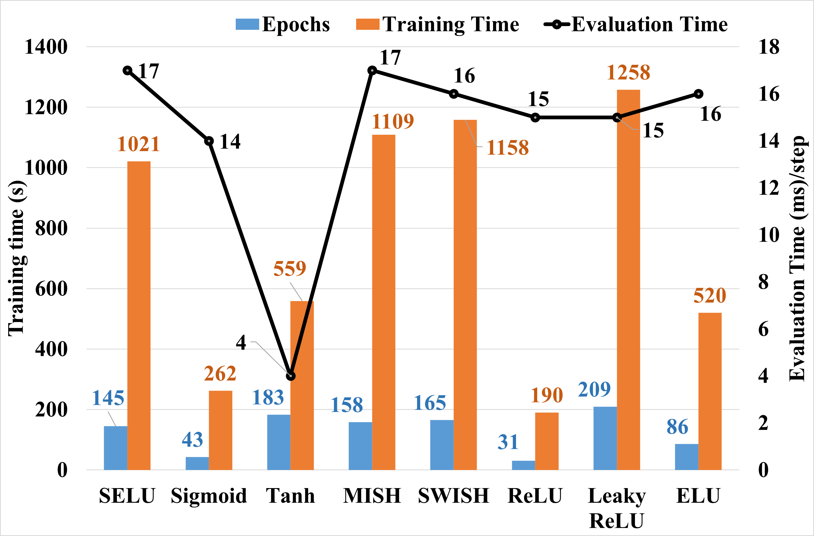

# Impact of Activation Functions in Deep Learning Based State of Charge Estimation for Batteries
## Abstract
Deep learning (DL) models are becoming popular for estimating State of Charge (SOC) in batteries. These models are good at finding complex patterns in data. This means that there is no need to fully understand the physics of how batteries work to use them, making DL models easier to implement than other methods. Within DL, activation functions are pivotal as they introduce non-linearity, enabling the capture of complex data relationships. This study systematically examines the impact of various activation functions on the performance of a DL model, specifically Deep LSTM. Notable differences in model performance based on activation function choice are revealed. Mean Absolute Errors (MAE) are reported as 1.91%, 1.99%, and 2.03% for models trained with SELU, Leaky ReLU, and Tanh activations, respectively. The SELU-trained model achieves the highest accuracy. However, the Tanh model significantly outperforms others in computational efficiency per step, particularly in GPU-enabled environments. It requires only 4ms/step, approximately 71% faster than its nearest counterpart. This efficiency is critical for periodic model training to accommodate battery aging effects on SOC predictions over time, as reduced training time leads to lower computational and deployment costs.

## Activation Functions

### Tanh
$$
\text{Tanh}(x) = \frac{e^x - e^{-x}}{e^x + e^{-x}}
$$

### Sigmoid
$$
S(x) = \frac{1}{1 + e^{-x}}
$$

### Rectified Linear Unit (ReLU)
$$
\text{ReLU}(x) = \max(0, x)
$$

### Exponential Linear Unit (ELU)
$$
\text{ELU}(x) = 
\begin{cases} 
x & \text{if } x \geq 0 \\ 
\alpha \cdot (e^x - 1) & \text{if } x < 0 
\end{cases}
$$

### Scaled Exponential Linear Unit (SELU)
$$
\text{SELU}(x) = \lambda 
\begin{cases}
x & \text{if } x > 0 \\
\alpha \cdot (\exp(x) - 1) & \text{if } x \leq 0
\end{cases}
$$

### Mish
$$
\text{mish}(x) = x \cdot \text{Tanh}(\text{softplus}(x))
$$


$$
\text{softplus}(x) = \ln(1 + e^x)
$$

### Swish
$$
\text{Swish}(x) = x \cdot \sigma(x)
$$

### Leaky Rectified Linear Unit (Leaky ReLU)
$$
\text{LeakyReLU}(x) = 
\begin{cases}
x & \text{if } x > 0 \\
\alpha \cdot x & \text{otherwise}
\end{cases}
$$

where, in SELU,  $\lambda$ $\approx$ 1.05 is the scale and $\alpha$ $\approx$ 1.67 is the parameter that is hard-coded in the formula to ensure self-normalization. $\alpha$ in ELU and LeakyReLU are the magnitude at which a slope is added to the negative input's output and help in mitigating vanishing gradient problems. $\sigma$ in Swish is a sigmoid function.

## Figure 1: Activation Functions and it's Derivatives


## Results

## Table 1: Metrics Results

| **Activation Functions** | **MSE**     | **R2 Score** | **RMSE**   | **MAE**    |
|--------------------------|-------------|--------------|------------|------------|
| SELU                     | **0.0006832** | **0.9912937** | **0.0261386** | **0.0190569** |
| Sigmoid                  | 0.0023292    | 0.9703187     | 0.0482623   | 0.0374190   |
| Tanh                     | **0.0007723** | **0.9901575** | **0.0277919** | **0.0203434** |
| MISH                     | 0.0009638    | 0.9877177     | 0.0310461   | 0.0241956   |
| SWISH                    | 0.0008457    | 0.9892224     | 0.0290822   | 0.0221944   |
| ReLU<sup>1</sup>      | 0.3562196    | -3.5392281    | 0.5968414   | 0.5270140   |
| Leaky ReLU<sup>2</sup> | **0.0007369** | **0.9906095** | **0.0271463** | **0.0198556** |
| ELU                     | 0.0009056    | 0.9884599     | 0.0300934   | 0.0225375   |

<sup>1</sup>*ReLU is not considered for evaluation due to its non-performance.*

<sup>2</sup>*The parameter* $\alpha$ *is kept at default value of 0.01.*

## Figure 2: Results Comparison


## Codes and model weights will be released at the earliest once the paper is published.

## Citation
```
@INPROCEEDINGS{PaperID 431,
  author={Prem Kumar, Pradeesh and Satheesh, Rahul and Alhelou, Hassan Haes},
  booktitle={2024 IEEE 4th International Conference on Sustainable Energy and Future Electric Transportation (SEFET)},
  title={Impact of Activation Functions in Deep Learning Based State of Charge Estimation for Batteries},
  year={2024},
  volume={},
  number={},
  pages={},
  keywords={Electric Vehicles; Deep Learning; LSTM; Activation functions; State of Charge},
  doi={},
}
```
```
@inproceedings{10.1145/3462203.3475878,
author = {Wong, Kei Long and Bosello, Michael and Tse, Rita and Falcomer, Carlo and Rossi, Claudio and Pau, Giovanni},
title = {Li-Ion Batteries State-of-Charge Estimation Using Deep LSTM at Various Battery Specifications and Discharge Cycles},
year = {2021},
isbn = {9781450384780},
publisher = {Association for Computing Machinery},
address = {New York, NY, USA},
url = {https://doi.org/10.1145/3462203.3475878},
doi = {10.1145/3462203.3475878},
booktitle = {Proceedings of the Conference on Information Technology for Social Good},
pages = {85–90},
numpages = {6},
location = {Roma, Italy},
series = {GoodIT '21}
}
```
### Dataset Used
```
Kollmeyer, Philip; Vidal, Carlos; Naguib, Mina; Skells, Michael  (2020), “LG 18650HG2 Li-ion Battery Data and Example Deep Neural Network xEV SOC Estimator Script”, Mendeley Data, V3, doi: 10.17632/cp3473x7xv.3
```